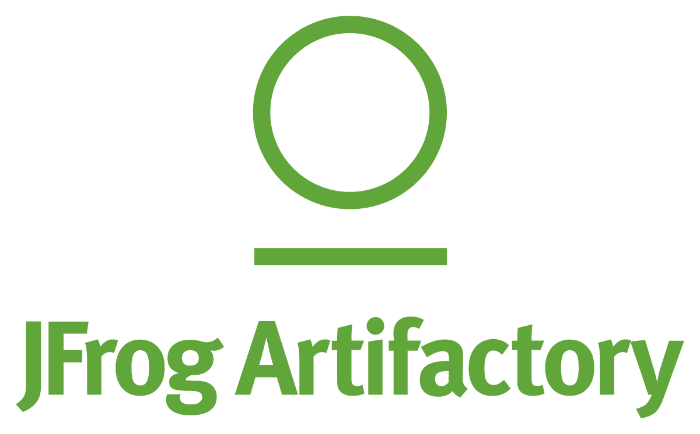

.center[.autoscale[]]
---
# Overview
### 1. What and Why?
### 2. Key Features
### 4. Deployment
### 5. Costs

---
# What and Why?
### What: Universal repository manager
&nbsp;
&nbsp;

### Why: Single source of truth for all packages
### Why: Reduced administrative overhead
### Why: Allows our tooling to use their native formats
### Why: Unified identities across different authentication mechanisms

???

---
# Key Features

### Caching proxies
Can be set up in front of 3rd party repos and are smart enough to only proxy the packages clients ask for.

### Virtual repos
Combine several internal repos and/or caching proxies to create a single unified repo for clients to use.

### Authentication
Uses backends like LDAP or OAuth, or handles it internally, but either way they offer API tokens and/or user/pass authentication on package resources themselves without much additional configuration.

### Extensive API
Anything accomplishable in the interface can also be done from the API, enabling deep test and deployment automation.

???

---
# Deployment
### Ansible role to launch Artifactory using Docker Compose
&nbsp;

### Limited parameterization and does not pre-configure the application.
&nbsp;

### SaaS is a viable option, but transfer and storage costs are a concern.
&nbsp;

### Depending on data usage, it might be worth moving on-premise later.
&nbsp;
---
# Costs

### _Pro_ - $2,950 p/a.
Single on-premise perpetual license. 1 year of upgrades, basic support.

### _Pro Plus_ - $7,900 p/a.
Pro license plus 1 training session, 2 dedicated support contacts, and a 9/5 SLA.

### _Enterprise SaaS_ - $5,514-$7,680+ p/a .small[for 5GB to 100GB of monthly transfer and storage use.]

Single tenant managed server in AWS, enterprise license, 1 training session, 24/7 SLA, free SSL cert and hostname.

---
# Laziest demo ever

.center[<iframe width="560" height="315" src="https://www.youtube.com/embed/MGXrPz9wwOY?t=67" frameborder="0" allowfullscreen></iframe>]

???
### 1:10 for repo setup
### 2:40 for "set me up" demo
### 4:20 for build w/ deps from af and deploy to af
